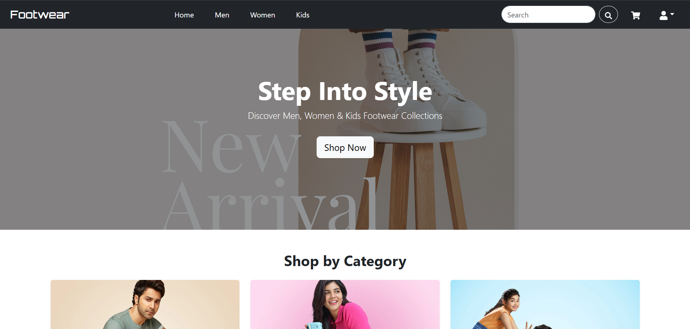
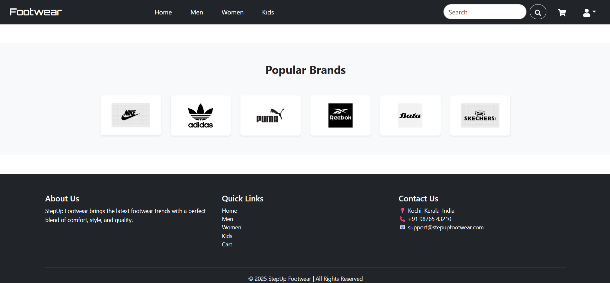
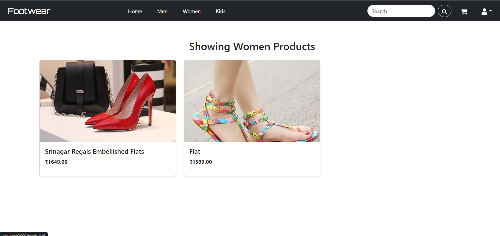
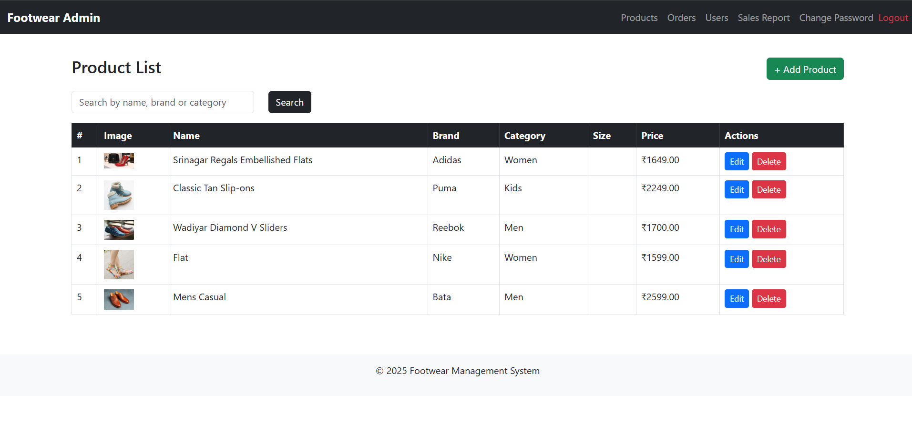
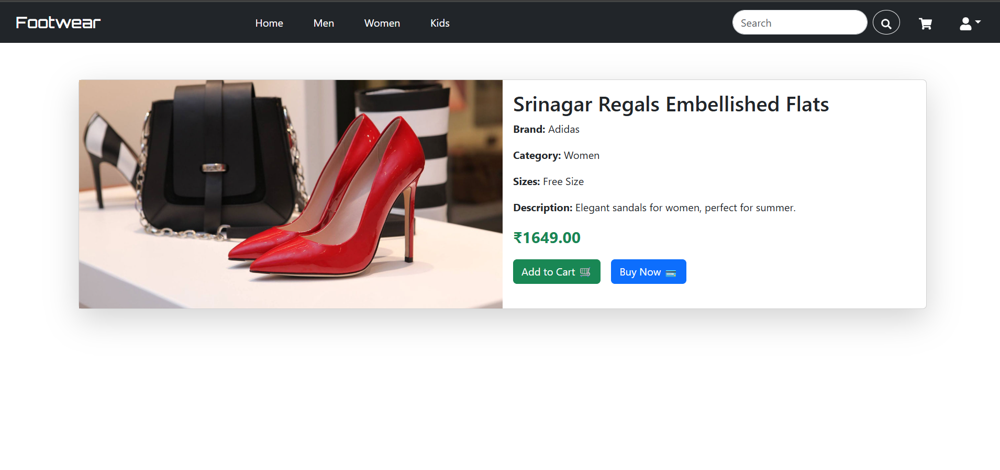
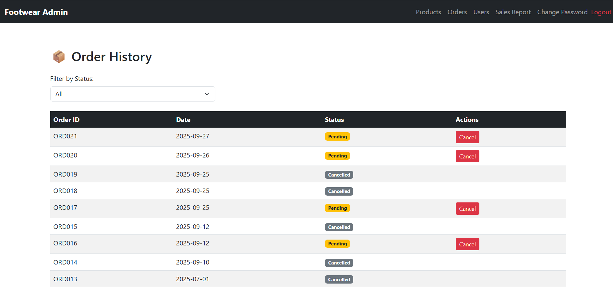
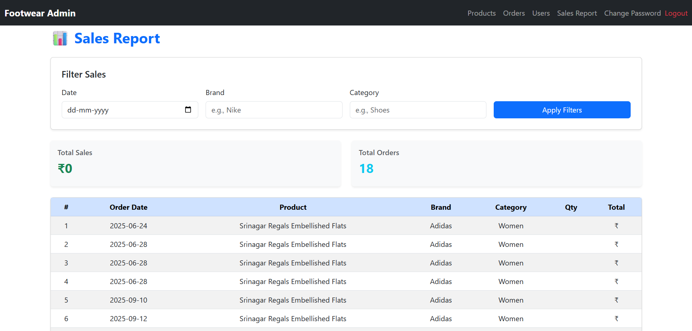

# 👟 Footwear E-commerce Site

A full-stack e-commerce web application for selling footwear online.  
Built with React (Frontend) and Django (Backend). Includes secure user authentication, product listings, search, cart, order history, and admin controls.

---

## 📌 Features

### 👤 User Features
- Sign up, login, and change password
- Browse products by category and brand
- Add/remove products from cart
- Place orders and view order history
- Edit user profile

### 🛠️ Admin Features
- Add/edit products
- View product list
- Hide products from homepage (status = Hidden)
- Analyze sales report
- Update order status

---

## 🧱 Tech Stack
- Frontend: React, React Router, Axios, Bootstrap
- Backend: Django REST Framework
- Database: MySQL / SQLite
- Authentication: JWT

---
## 📸 Screenshots

### 🏠 Homepage

### 🛍️ Product List

### 🏷️ Brand Page

### 👩 Women Category

### 🛠️ Admin Product Page

### 📄 Product Detail Page

### 📦 Order History

### 📊 Sales Report

✍️ Author: **Thahliyaa Yasmin**  
[GitHub](https://github.com/Thahliyaa)

